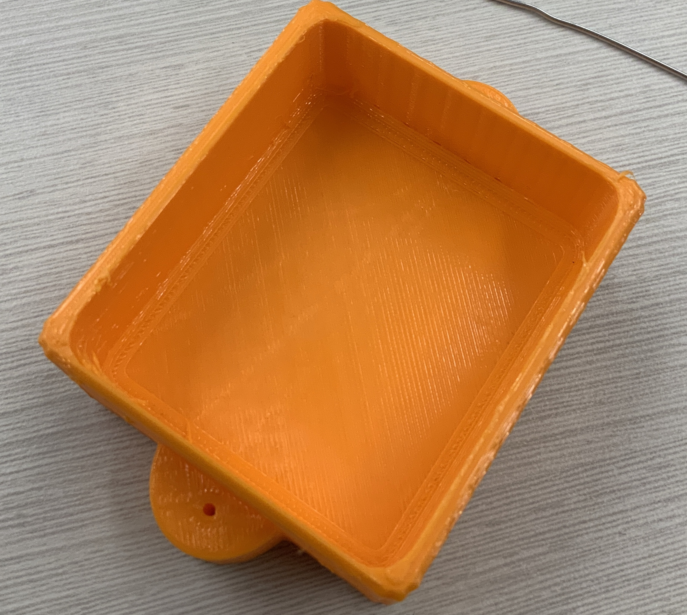

# Mission-to-Mars-Documentation
  
## Team Name: Weltraumunternehmen
  * Means "Space Company" 
* Sensor Payloads Name: das Auge im Weltraum
  * Means "The eye in space"
* Summary of solution: 
  * 
* Photos of Sensor Payload: 

* Screenshots of Data: 
  * 
* Overview of Process: 
  * 
* Team Reflection: 
  * 

